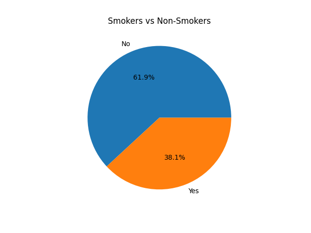

# 📊 Smokers vs Non-Smokers Analysis

## 📌 Project Overview
This project analyzes the distribution of smokers and non-smokers using a real dataset.  
The data is processed with Python and visualized through a pie chart.

---

## 📂 Dataset
- **Source:** https://github.com/mwaskom/seaborn-data  
- **File:** `tips.csv`

---

## ⚙️ Technologies Used
- Python  
- Pandas  
- Matplotlib  

---

## 📊 Visualization
Below is the generated chart showing the proportion of smokers vs non-smokers:



---

## 🧠 What This Project Does
- Loads the dataset from an online source  
- Counts smokers vs non-smokers  
- Displays the result in a pie chart  

---

## 🚀 How to Run

### Install dependencies
```bash
pip install pandas matplotlib
